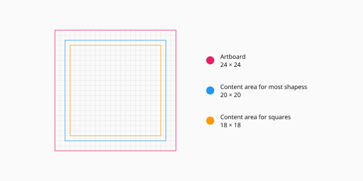
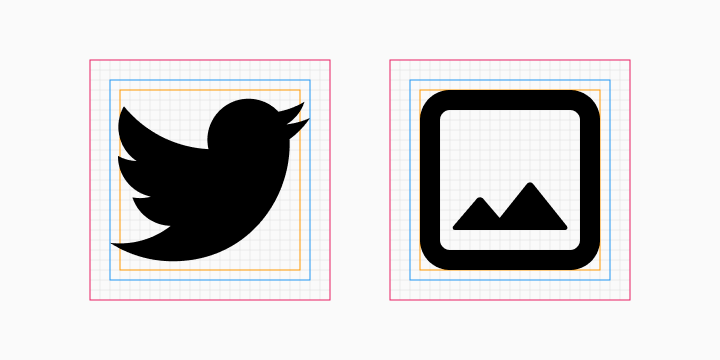

# Lawnicons reFilled contributing guide
Welcome to the Lawnicons reFilled contributing guide! This file will tell you what you need to know to contribute to Lawnicons reFilled.

Before you start, please [fork](https://github.com/yfunk/lawnicons-refilled/fork) the project and clone it to your machine. Afterwards, you can either contribute icons or code.

## Icon guidelines
See the below image for a summary of the icon guidelines. 

Each icon must fit the 20x20 or 18x18 (depending on the shape) content area size. It must not be smaller nor bigger than the specified sizes.





In addition to the above, the icons must have a filled (not outlined) style.




## Adding an icon to Lawnicon reFilled
Here's how to add an icon to Lawnicon reFilled:

### Prerequesties
* Your icon in the SVG format, adhering to the [above guidelines](#contributing-icons). The filename must use snake case (e.g. `files_by_google.svg`).
* The package and activity name of the app.

### Via `icontool.py`
Please check the [icon tool guide](/docs/icontool_guide.md) for more information.

### Via manual process
1. Add the ready SVG to the `svgs` directory.

1. Add a new line to `app/assets/appfilter.xml` (in alphabetical order, by the `name` attribute), and map the new icon to a package name and app's activity. For example:

    ```xml
      <item component="ComponentInfo{com.google.android.apps.nbu.files/com.google.android.apps.nbu.files.home.HomeActivity}" drawable="files_by_google" name="Files by Google"/>
    ```

    A general template is as follows:

    ```xml
    <item component="ComponentInfo{[PACKAGE_NAME]/[APP_ACIVITY_NAME]}" drawable="[DRAWABLE NAME]" name="[APP NAME]"/>
    ```

1. Done! You're ready to open a pull request. Please set `develop` as the base branch.

## Finding the package and activity name of an app
### Using `adb`
1. Connect your Android device or emulator to your laptop/desktop PC that has `adb` installed (see [this tutorial](https://www.xda-developers.com/install-adb-windows-macos-linux/) for more information) and open the app whose details you want to inspect, e.g. Telegram.
1. Open a new Command Prompt or Terminal window and input `adb devices`.
1. Finally, type the below-given command to get the information about the currently open application.

  **For Mac or Linux**:

  ```console
  adb shell dumpsys window | grep 'mCurrentFocus'
  ```

  **For Windows**:

  ```console
  adb shell dumpsys window | find "mCurrentFocus"
  ```
  

  The part before the `/` character in the above image, i.e. `org.telegram.messenger`, is the package name (`[PACKAGE_NAME]`). The part after it, i.e. `org.telegram.messenger.DefaultIcon`, is the activity name (`[APP_ACIVITY_NAME]`).

### Using 3rd-party apps
#### IconRequest app

1. Download IconRequest: [Google Play](https://play.google.com/store/apps/details?id=de.kaiserdragon.iconrequest) • [GitHub](https://github.com/Kaiserdragon2/IconRequest/releases).
2. Launch IconRequest and tap one of the options:
- UPDATE EXISTING — to copy packages with activities. [How to request icons](https://kappa.lol/u_MBz), 22s video.
- REQUEST NEW — to save icon images and packages with activities. This option is better if you are creating icons.
3. Select the apps for which youʼd like to request or make icons.
4. Copy, save or share.

#### Icon Pusher app
1. Download the [Icon Pusher app](https://play.google.com/store/apps/details?id=dev.southpaw.iconpusher&hl=en&gl=US).
2. Launch the app.
3. Select the icon(s) you want to upload or select all by pressing the square in the top right. Then press "Send".
4. View the packages with the activities for each app on the [Icon Pusher website](https://iconpusher.com/). Please make sure the `drawable="[DRAWABLE NAME]"` matches the icon SVG file name.
